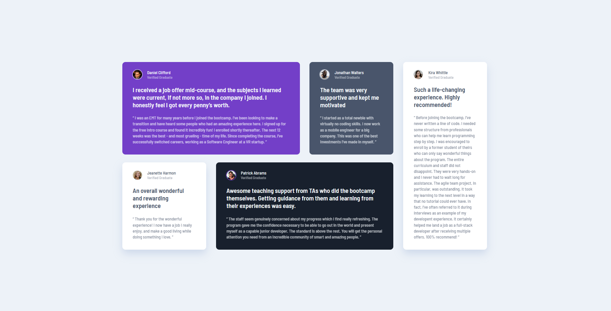
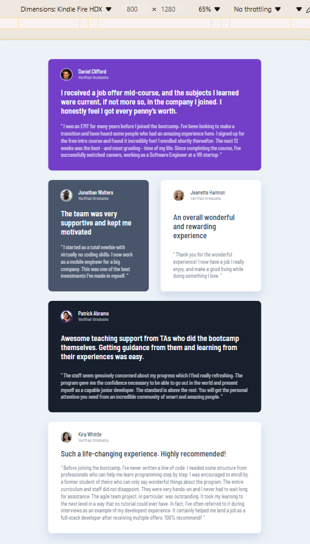
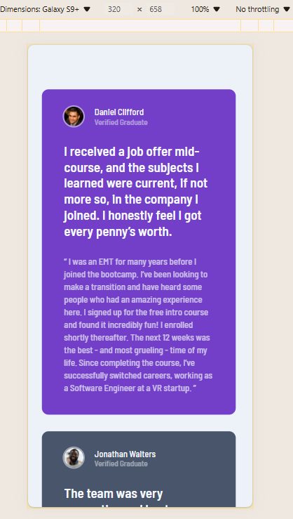

# Frontend Mentor - Testimonials grid section solution

This is a solution to the [Testimonials grid section challenge on Frontend Mentor](https://www.frontendmentor.io/challenges/testimonials-grid-section-Nnw6J7Un7). Frontend Mentor challenges help you improve your coding skills by building realistic projects. 

## Table of contents

- [Overview](#overview)
  - [The challenge](#the-challenge)
  - [Screenshot](#screenshot)
  - [Links](#links)
- [My process](#my-process)
  - [Built with](#built-with)
  - [What I learned](#what-i-learned)
  - [Continued development](#continued-development)
  - [Useful resources](#useful-resources)
- [Author](#author)

## Overview

### The challenge

Users should be able to:

- View the optimal layout for the site depending on their device's screen size.

### Screenshot

### Links

- Solution URL: [My solution here](https://www.frontendmentor.io/solutions/responsive-testimonials-section-created-with-grid-e4hfEbVNv6)
- Live Site URL: [Live site here](https://grimm-n.github.io/testimonials-grid-section/)

## My process

### Built with

- Semantic HTML5 markup
- CSS custom properties
- Flexbox
- CSS Grid

### What I learned

I've come to appreciate the beauty of using CSS Grid even more. It’s amazing how flexible and powerful it is for creating layouts. I feel like I'm getting the hang of it!

### Continued development

My goal remains the same: to learn how to create perfectly mobile-adapted websites. I'm dedicated to mastering this skill.

### Useful resources

- [A (more) Modern CSS Reset](https://piccalil.li/blog/a-more-modern-css-reset/) - Thanks to Andy Bell for his wonderful cheat sheet! I'm using it, adapting it to my needs, and I highly recommend it to everyone.
- [MDN](https://developer.mozilla.org/) - I always revisit the information on this site whenever I feel stuck. It's an excellent knowledge library, and I find it incredibly helpfu.

## Author

- Frontend Mentor - [@Grimm-N](https://www.frontendmentor.io/profile/Grimm-N)
- Twitter - [@Grimm__N](https://x.com/Grimm__N)
